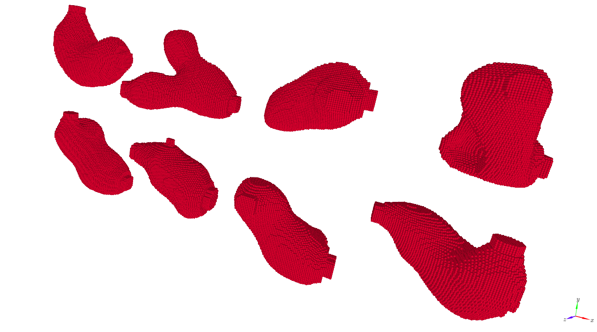

# Generative AI based Geometry Generation for CFD
Master's Thesis work done at TUM in collaboration with BMW.
This work aims on using Generative Models to compute initial guesses for 2D and 3D flow manifold geometries that minimize pressure drop between inflow and outflow.

   

The topology optimization module requires PyTorch and Phiflow to be installed in the existing environment. After installing a **GPU Compatible** version of PyTorch, please install Phiflow:


```
pip install phiflow
```
## 2D Simulation Cases
To generate simulation cases for the 2D topology optimization problem. Run the script data_gen2D.py:
```
nohup [PATH TO ENVIRONMENT]/bin/python -u data_gen2D.py >> TopOpt2D.out &
```
For the cases generated, split them into training and test datasets by running:
```
nohup [PATH TO ENVIRONMENT]/bin/python -u prepare_split.py --case_dim 2D >> prepare_split.out &
```
### Training Networks
We mainly use Wasserstein Generative Adversarial Networks and Diffusion Models as the main generative models to generate geoemtries in 2D and 3D.

The input geometries and flow solution are taken as input to determine a pressure-drop minimizing geometry.

#### WGAN Training
WGANs use variational auto-encoders to encode the input domain and flow solution as a conditioning vector that is input to the generator for conditional generation.

To train the variational auto-encoder, run the script:
```
nohup [PATH TO ENVIRONMENT]/bin/python -u train_vae.py --load_ae_model_name VAE_wgans.pth  >> VAE_wgans.out &
```

To train the WGAN model next, run the script:
```
nohup [PATH TO ENVIRONMENT]/bin/python -u train_wgan_model.py --load_gen_model_name generator.pth --load_critic_model_name critic.pth --load_ae_model_name VAE_wgans.pth >> train_wgan.out &
```

#### Diffusion 
To train the Diffusion Model, run the script:
```
nohup [PATH TO ENVIRONMENT]/bin/python -u train_diffusion_model.py --load_diff_model_name DDPM2D_unet.pth >> DDPM2D_unet.out &
```

#### Latent Diffusion
To train the Latent Diffusion model, a variational auto-encoder must be trained to convert the geometries to 16X16 resolution representation:
```
nohup [PATH TO ENVIRONMENT]/bin/python -u train_vae_diff_latent2D.py --load_ae_model_name VAE_diff2D_LD.pth >> VAE_diff2D_LD.out &
```

To train the latent diffusion model next, run the script:
```
nohup [PATH TO ENVIRONMENT]/bin/python -u train_diff_latent2D_model.py --load_diff_model_name DDPM2D_unet_LD.pth  >> DDPM2D_unet_LD.out &
```
## 3D Simulation Cases
Similarly for 3D, to generate case data:
```
nohup [PATH TO ENVIRONMENT]/bin/python -u data_gen3D.py >> TopOpt3D.out &
```
After the above, split the data into training and testing:
```
nohup [PATH TO ENVIRONMENT]/bin/python prepare_split.py --case_dim 3D >> prepare_split3D.out & 
```
Note: The data splitting for 3D might take a few minutes to run. Please be patient.

### Training Networks
We use Latent Diffusion models to predict geometries in 3D. We first train our VAE to generate reproducible latent representations of the geometry in lower resolutions.

#### Latent Diffusion
Similar to the previous section we use latent diffusion for 3D geometry prediction. To train the network, run the following script:

```
nohup [PATH TO ENVIRONMENT]/bin/python -u train_vae_diff_latent3D.py --load_ae_model_name VAE_diff3D_LD.pth >> VAE_diff3D_LD.out &
```

We then  train our diffusion model using these representations as targets:

```
nohup [PATH TO ENVIRONMENT]/bin/python -u train_diff_latent3D_model.py --load_diff_model_name DDPM3D_unet_LD.pth >> DDPM3D_unet_LD.out &
```

Note: These networks take considerable of time to train (~5 mins per epoch). Batch-wise training progress can be viewed in the output file.

## Results
To test the inference abilities of the WGAN, Diffusion and Latent Diffusion models in 2D for the test set, run the following:

```
nohup [PATH TO ENVIRONMENT]/bin/python -u plot_inference_2D.py >> plot_inference2D.out &
```

       

         WGAN               Diffusion         Latent Diffusion        Targets

Similarly for 3D, run the following:

```
nohup [PATH TO ENVIRONMENT]/bin/python -u plot_inference_3D.py >> plot_inference3D.out &
```
     

             Input Domain                  Predictions                      Targets

To evaluate the models based on the suitability of the geometries generated given the design objective at hand (predicting optimal starting topologies that have minimal pressure drop), we execute the following scripts that predict initial geometries using different generative models and then use these geometries as starting points for further optimization. With this we get a better idea of how performant the initial predictions are for the overall task of optimizing geometries for lower pressure drop.

For 2D:

```
nohup [PATH TO ENVIRONMENT]/bin/python -u evaluate2D.py --network_type Normal >> evaluate_Normal_2D_120.out &
nohup [PATH TO ENVIRONMENT]/bin/python -u evaluate2D.py --network_type WGAN >> evaluate_WGAN_2D_120.out &
nohup [PATH TO ENVIRONMENT]/bin/python -u evaluate2D.py --network_type Diffusion >> evaluate_Diffusion_2D_120.out &
nohup [PATH TO ENVIRONMENT]/bin/python -u evaluate2D.py --network_type Latent_Diffusion >> evaluate_Latent_Diff2D_120.out &
```

For 3D:
```
nohup [PATH TO ENVIRONMENT]/bin/python -u evaluate3D.py --network_type Normal >> evaluate_Normal_3D_60.out &
nohup [PATH TO ENVIRONMENT]/bin/python -u evaluate3D.py --network_type Latent_Diffusion >> evaluate_Latent_Diff_3D_60.out &
```
Each running instance of evaluate takes min 10 gigabytes of GPU memory to run. Its recommended to reserve a GPU to execute each of the above evaluate script run when doing parallely. Evaluating the entire test dataset in this work took 2 weeks with each evaluate script running on its own NVIDIA RTX A5000 GPU.

After all test cases have been evaluated, execute the following script to obtain the pdrop plots and run time bar plots:

```
nohup [PATH TO ENVIRONMENT]/bin/python -u plot_pdrop2D.py >> plot_pdrop2D.out &
nohup [PATH TO ENVIRONMENT]/bin/python -u plot_pdrop3D.py >> plot_pdrop3D.out &
```
 

             Pressure Drop Plot 2D                          Pressure Drop Plot 3D

 

                Runtime Plot 2D                               Runtime Plot 3D


Run the following scripts to compute flow cases that lie outside training distribution. For 2D:

```
nohup [PATH TO ENVIRONMENT]/bin/python -u plot_case_OOD_2D.py >> plot_case_OOD_2D.out &
```


    Predictions on 2D cases outside trained distribution

Where from top to bottom in the above figure, we have the Input Domain, WGAN, Diffusion, Latent Diffusion predictions and Targets geometries respectively. 

For 3D:
```
nohup [PATH TO ENVIRONMENT]/bin/python -u plot_case_OOD_3D.py >> plot_case_OOD_3D.out &
```

  

    Predictions on 3D cases outside trained distribution

On the rightmost side of the above figure we have the predicted flow manifold after laplacian smoothing.


